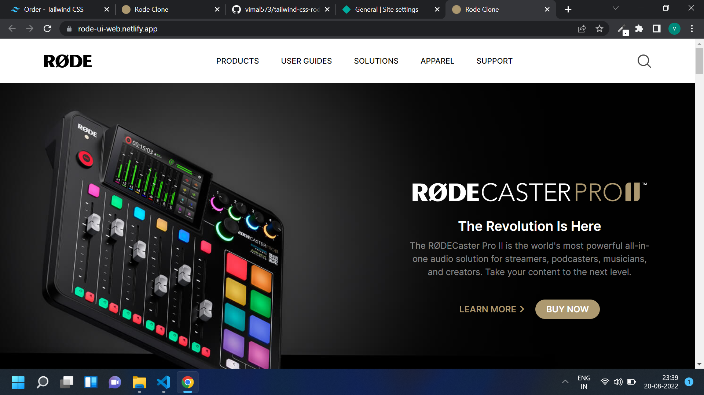

# Tailwind Assignment Rode UI Clone

## Rode UI Clone [Live Link](https://rode-ui-web.netlify.app//)

- Skills Gained in this project

  - create whole project through reading tailwind doccumentation

  - learn to apply tailwind pre written class

  - apply background image, colors, background image thorugh taillwind

  - learn responsive design with tailwind define screen sizes and and classes

---

## Time taken to finish this project

- 8 hour 45 minutes to complete it
- 3 hour 50 minutes to make it responsive

#### Screenshot

